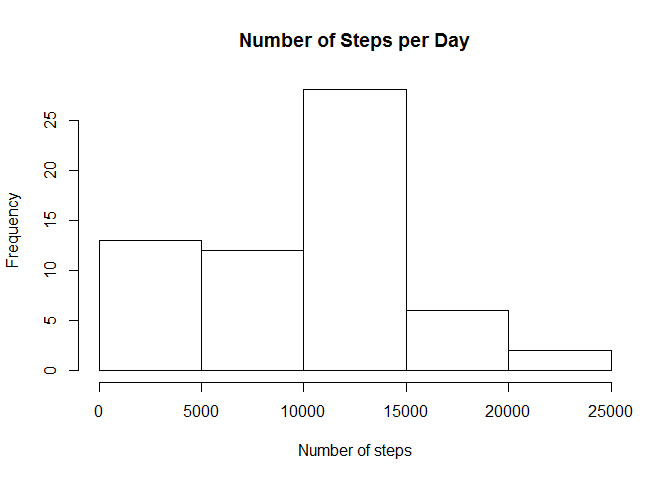
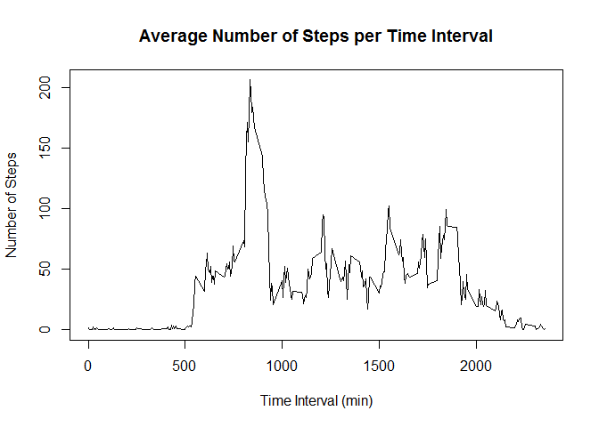
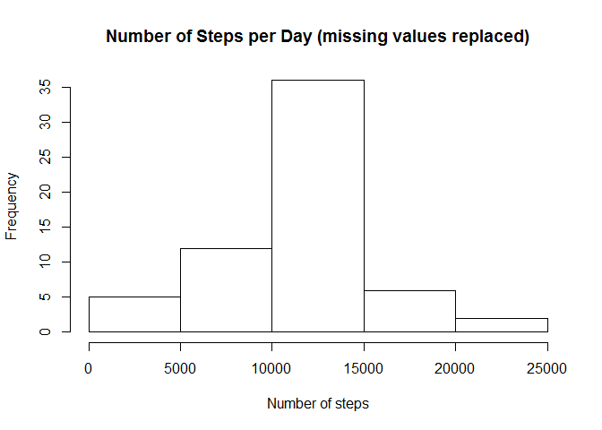
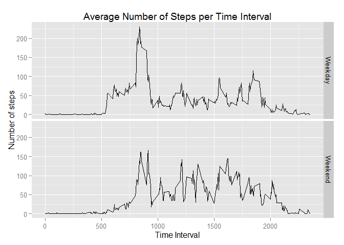

# Reproducible Research: Peer Assessment 1


## Loading and preprocessing the data
Unzip and load the data into an R dataset.

```r
path = "C:\\Users\\Joe\\Git\\RepData"
unzip(paste(path,"activity.zip",sep="\\"), exdir = path)
steps = read.csv(paste(path,"activity.csv",sep="\\"), na.strings="NA", colClasses=c("numeric","character","numeric"))
```
Convert the character field into a date

```r
steps$date1 = as.Date(steps$date, format="%Y-%m-%d")
```
Load libraries to be used 

```r
library(dplyr)
```

```
## 
## Attaching package: 'dplyr'
## 
## The following object is masked from 'package:stats':
## 
##     filter
## 
## The following objects are masked from 'package:base':
## 
##     intersect, setdiff, setequal, union
```

```r
library(ggplot2)
```


## What is mean total number of steps taken per day?
Compute the mean and median and show a histogram of the total number of steps per day.

```r
totalSteps = steps %>% group_by(date1) %>% summarise(steps=sum(steps, na.rm=TRUE)) %>% arrange(date1)
hist(totalSteps$steps, main="Number of Steps per Day", xlab="Number of steps")
```

 

```r
meanSteps = round(mean(totalSteps$steps),0)
medianSteps = as.integer(round(median(totalSteps$steps),0))
```
The mean number of steps per day is 9354.  
The median number of steps per day is 10395.


## What is the average daily activity pattern?
Calculate the average number of steps per 5 minute interval across all days.

```r
avgIntvlSteps = steps %>% group_by(interval) %>% summarise(steps=mean(steps, na.rm=TRUE)) %>% arrange(interval)
plot(avgIntvlSteps$interval, avgIntvlSteps$steps, type="l", xlab="Time Interval (min)", 
     ylab="Number of Steps", main="Average Number of Steps per Time Interval")
```

 

Find the maximum number of steps and the corresponding time interval.

```r
maxNumSteps = round(max(avgIntvlSteps$steps),0)
maxTimeInt = avgIntvlSteps$interval[which.max(avgIntvlSteps$steps)]
```
The time interval 835 contains the maximum number of steps (206 steps) (averaged across all days).


## Imputing missing values
Count the number of rows with NAs, and the total number of NAs in the dataset.

```r
rowNas = sum(is.na(steps[,1]) | is.na(steps[,2]) | is.na(steps[,3]))
totalNas = sum(is.na(steps))
```
The number of rows with at least one NA value in the row is 2304.  
The total number of NAs in the data is 2304.    


Create a new dataset with missing values replaced with the average for that interval.

```r
stepsNoNas = steps
stepsNoNas[is.na(steps$steps),]$steps = 
  sapply(steps[is.na(steps$steps),]$interval, function(x) round(avgIntvlSteps[avgIntvlSteps$interval == x,]$steps,0))
```
Show a histogram of the total number of steps per day.

```r
totalStepsNoNas = stepsNoNas %>% group_by(date1) %>% summarise(steps=sum(steps, na.rm=TRUE)) %>% arrange(date1)
hist(totalStepsNoNas$steps)
```

 

Compute the mean and median of the number of steps per day.

```r
meanStepsNoNas = as.integer(round(mean(totalStepsNoNas$steps),0))
medianStepsNoNas = as.integer(round(median(totalStepsNoNas$steps),0))
sumStepsNoNas = as.integer(sum(round(avgIntvlSteps$steps,0)))
```
The mean number of steps per day (with NAs replaced) is 10766.  
The median number of steps per day (with NAs replaced) is 10762.  
The imputation approach has caused the mean and median to increase, and has increased the number of days containing 10762 steps, as this is the sum of the average number of steps for each time interval. This has caused a spike in the histogram around that value.  

## Are there differences in activity patterns between weekdays and weekends?
Create a factor variable to show if the data is for a weekday or a weekend.

```r
weekends = function(dates){ factor(c("Weekday","Weekend")[as.numeric(weekdays(dates) %in% c("Saturday","Sunday"))+1]) }
stepsNoNas$weekend = weekends(stepsNoNas$date1)
```
Summarise data by weekday and time interval, and plot.

```r
avStepsNoNas = stepsNoNas %>% group_by(weekend, interval) %>% summarise(steps=mean(steps, na.rm=TRUE)) %>% arrange(weekend, interval)
qplot(data=avStepsNoNas, x=interval, y=steps, facets=weekend~., geom="line", xlab="Time Interval", ylab="Number of steps", main="Average Number of Steps per Time Interval")
```

 
